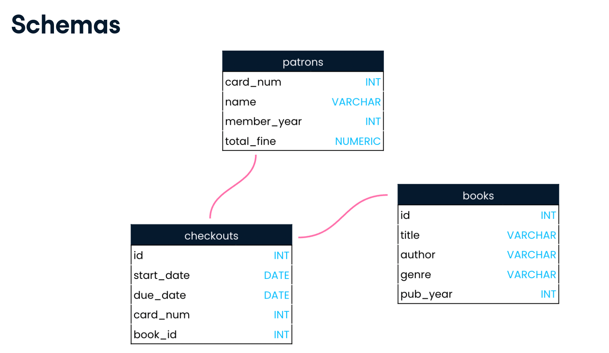

# Database
  A database stores data.  
  Databases are made up of tables.  

# Relational Database
  Relational database defines the relationships between the tables present in the database.  

# SQL
  Structured Query Language.  
  SQL is used for creating, querying and updating databases.  
  SQL is used when an organization has lots of data with complex relationships.

# Tables
  Tables consists of rows(**Records**) and columns(**Fields**).  
  **Table names** should be **lowercases** and should **not** contain any Markdown Code Block(use underscores instead). Also table names should be plural. Eg : products table  
  **Field names** should be **lowercases** and should **not** include any **spaces**. Also field names should be singular. Eg: name, age.  
  A table should not contain two identical field names and the field names should be different from the table name.
  When a table is created the **datatype of each field** should be mentioned.  

# Data types in SQL
  - CHAR - supports strings upto 250 characters.
  - VARCHAR - supports both small and large strings. varchar is commonly used for storing strings.
  - INT - Whole numbers. Supports signed range from -2147483648 to 2147483647. Unsigned range is from 0 to 4294967295
  - BIGINT - A very large interger.
  - FLOAT - Numbers that include a fractional part.
  - DOUBLE
  - NUMERIC - NUMERIC types store exact numeric data values. Stores floats whick have upto 38 digits(including those before and after the decimal point). These types are used when it is important to preserve exact precision, for example with monetary data. **Decimal** and numeric are synonyms and can be used interchangeably.
  - DATE - Date in YYYY-MM-DD format.

  
# Schemas
  Schemas are referred as blueprints of the databases. They show the databases's design ie. what tables are included in the database and the relationship between them and also the data type of each field present in the table.  
    

# Servers
  The information present in the database table are physically stored in the hard-disk of the server. Servers are used to perform operations to the database via requests made over a network.
